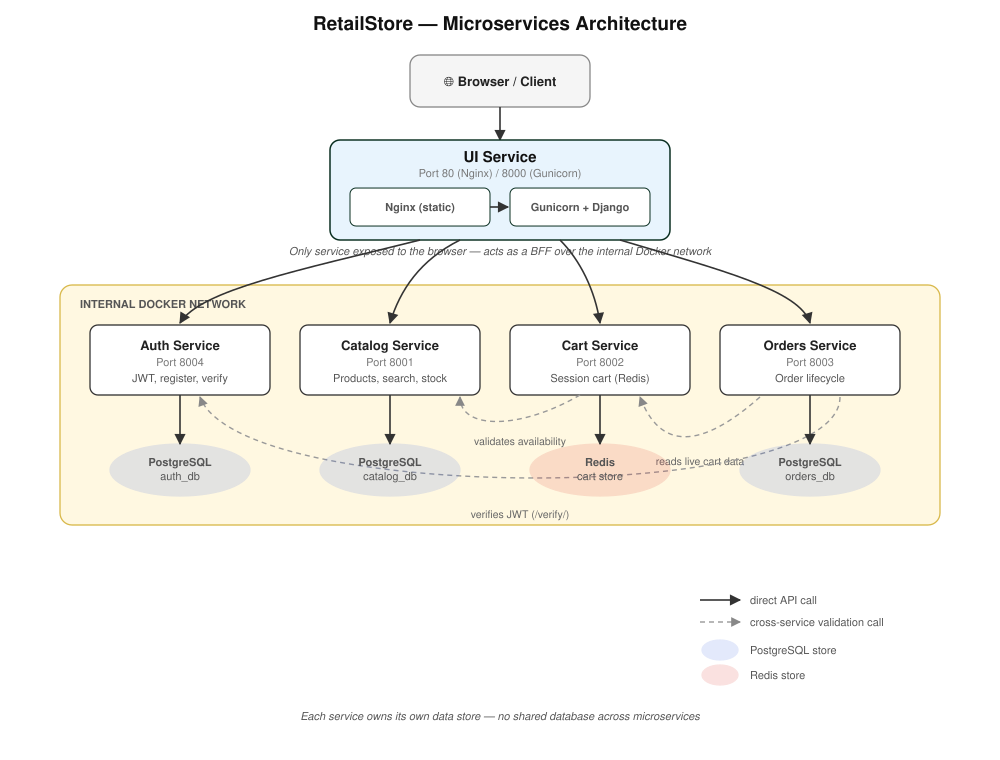
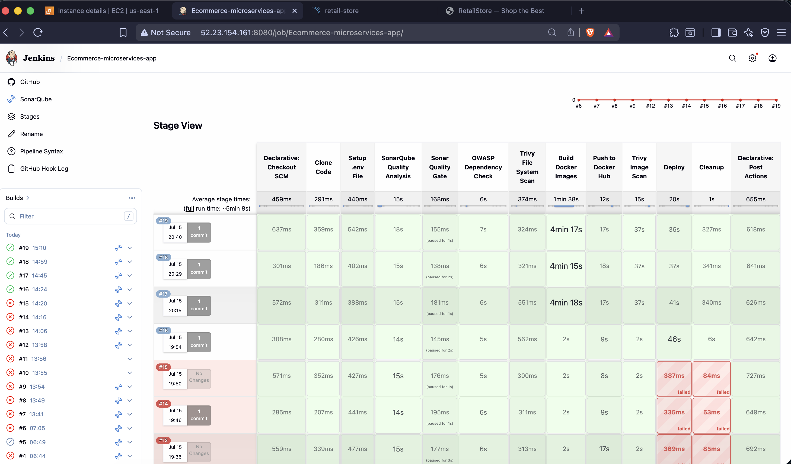

# RetailStore - Django Microservices E-Commerce

[](https://python.org)
[](https://djangoproject.com)
[](https://www.django-rest-framework.org)
[](https://postgresql.org)
[](https://redis.io)
[](https://docker.com)
[](https://jenkins.io)
[](https://devsecops.org)
[](LICENSE)

A production-ready e-commerce platform built with microservices architecture using Django and Django REST Framework. Each service is independently deployable, scalable, and maintains its own data store, following best practices for distributed systems.

## Table of Contents

- [Features](#features)
- [Architecture](#architecture)
- [Services Overview](#services-overview)
- [Technology Stack](#technology-stack)
- [Getting Started](#getting-started)
- [CI/CD Pipeline](#cicd-pipeline)
- [API Documentation](#api-documentation)
- [Security](#security)
- [Testing](#testing)
- [Docker Images](#docker-images)
- [Contributing](#contributing)
- [License](#license)

## Features

- **Microservices Architecture**: Independent services with dedicated databases
- **RESTful APIs**: Complete OpenAPI/Swagger documentation for all endpoints
- **JWT Authentication**: Secure token-based authentication with refresh and blacklisting
- **Session-based Cart**: Redis-backed shopping cart with automatic expiration
- **Order Management**: Complete order lifecycle with status tracking
- **Product Catalog**: Full-text search, categories, and inventory management
- **Responsive UI**: Server-side rendered storefront using Django templates and Bootstrap 5
- **Docker Ready**: Full containerization with Docker Compose orchestration
- **Production Grade**: Rate limiting, health checks, and proper error handling
- **Comprehensive Tests**: pytest-based test suite with factory patterns
- **DevSecOps Pipeline**: Automated CI/CD with security scanning and quality gates
- **AWS Deployment**: Automated EC2 deployment with health checks

---

## Architecture



The UI Service is the only service exposed to the browser. It acts as a Backend-for-Frontend (BFF), calling backend APIs over the internal Docker network.

---

## Services Overview

| Service | Port | Database | Responsibility |
|---------|------|----------|----------------|
| **Auth Service** | 8004 | PostgreSQL | User registration, JWT authentication, token management |
| **Catalog Service** | 8001 | PostgreSQL | Products, categories, search, inventory |
| **Cart Service** | 8002 | Redis | Session-based shopping cart |
| **Orders Service** | 8003 | PostgreSQL | Order placement, status lifecycle |
| **UI Service** | 80 (nginx) / 8000 (gunicorn) | None | Server-rendered storefront (Django Templates + Bootstrap 5) |

### Auth Service

Handles all user identity and authentication for the platform. Provides JWT-based login with 15-minute access tokens and 7-day refresh tokens. Token blacklisting on logout prevents reuse. Exposes a `/verify/` endpoint that other microservices can call to validate tokens without sharing the secret key directly. Rate-limits the login endpoint to prevent brute-force attacks.

### Catalog Service

Manages the product catalogue - products, categories, images, and flexible attributes. Supports full-text search, category filtering, featured product listing, and auto-marks items `out_of_stock` when inventory hits zero.

### Cart Service

Stateless from the application layer - all cart state lives in Redis. Validates product availability against Catalog before adding items. Enforces a maximum of 50 items and 99 units per item. Carts expire after 7 days of inactivity. Identified via `X-Session-Key` header.

### Orders Service

Places orders by pulling live cart data, then freezes prices as immutable line items. Enforces a strict status machine: PENDING -> CONFIRMED -> SHIPPED -> DELIVERED. Customers can cancel PENDING or CONFIRMED orders.

### UI Service

Six-page Django application: Home, Product Listing, Product Detail, Cart, Checkout, Order History & Detail. No database - uses signed-cookie sessions. Nginx serves static files; Gunicorn handles Django requests; Supervisord manages both processes in a single container.

---

## Technology Stack

| Layer | Technology |
|-------|------------|
| Language | Python 3.12 |
| Web Framework | Django 5.0, Django REST Framework 3.15 |
| Authentication | djangorestframework-simplejwt 5.3 (JWT + token blacklisting) |
| WSGI Server | Gunicorn 22 |
| Reverse Proxy | Nginx 1.27 |
| Process Manager | Supervisord |
| Relational DB | PostgreSQL 16 |
| Cache / Cart Store | Redis 7 |
| API Schema | drf-spectacular (OpenAPI 3) |
| Configuration | python-decouple |
| Testing | pytest, pytest-django, factory-boy, Faker |
| Containerization | Docker, multi-stage Dockerfile per service |
| CI/CD | Jenkins |

---

## Getting Started

### Prerequisites

- Docker 24+ and Docker Compose v2
- Git

### 1. Clone the Repository

```bash
git clone https://github.com/sumeet217/ecommerce-microservices-app.git
cd ecommerce-microservices-app
```

### 2. Configure Environment Variables

```bash
cp .env.example .env
# Edit .env and set all required variables:
# - DJANGO_SECRET_KEY for each service
# - Database passwords
# - JWT settings
```

### 3. Build and Start All Services

```bash
docker compose up --build -d
```

### 4. Access the Application

| URL | Description |
|-----|-------------|
| http://localhost | Storefront (Nginx) |
| http://localhost:8004 | Auth Service API |
| http://localhost:8001 | Catalog Service API |
| http://localhost:8002 | Cart Service API |
| http://localhost:8003 | Orders Service API |

### API Documentation (Swagger UI)

Access interactive API documentation at:

- Auth Service: `http://localhost:8004/api/docs/`
- Catalog Service: `http://localhost:8001/api/docs/`
- Cart Service: `http://localhost:8002/api/docs/`
- Orders Service: `http://localhost:8003/api/docs/`

### Useful Commands

```bash
# View logs for all services
docker compose logs -f

# View logs for a specific service
docker compose logs -f auth-service

# Stop all services
docker compose down

# Fresh start (removes volumes and databases)
docker compose down -v

# Restart a single service
docker compose restart auth-service

# Run migrations manually
docker compose exec auth-service python manage.py migrate

# Access service shell
docker compose exec catalog-service python manage.py shell
```

---

## Production Deployment (AWS EC2)

### EC2 Security Group Configuration

**Required Inbound Rules:**

| Port | Protocol | Source | Purpose |
|------|----------|--------|---------|
| 22 | TCP | Your IP only | SSH access |
| 80 | TCP | 0.0.0.0/0 | HTTP (Nginx entry point) |

**Note:** Service ports (8001-8004) should remain closed in production. All traffic routes through Nginx on port 80.

### Initial EC2 Setup

```bash
# 1. SSH into your EC2 instance
ssh -i your-key.pem ubuntu@<EC2_IP>

# 2. Clone the repository
git clone https://github.com/sumeet217/ecommerce-microservices-app.git
cd ecommerce-microservices-app

# 3. Create and configure .env file
cp .env.example .env
nano .env
```

### Critical: Production Environment Configuration

The `.env` file is gitignored and must be manually configured on the server. Add your EC2 public IP to all `ALLOWED_HOSTS` entries:

```bash
# Replace <EC2_IP> with your actual public IP (e.g., 52.23.154.161)
UI_DJANGO_ALLOWED_HOSTS=ui-service,localhost,127.0.0.1,nginx,<EC2_IP>
AUTH_DJANGO_ALLOWED_HOSTS=auth-service,localhost,127.0.0.1,<EC2_IP>
CATALOG_DJANGO_ALLOWED_HOSTS=catalog-service,localhost,127.0.0.1,<EC2_IP>
CART_DJANGO_ALLOWED_HOSTS=cart-service,localhost,127.0.0.1,<EC2_IP>
ORDERS_DJANGO_ALLOWED_HOSTS=orders-service,localhost,127.0.0.1,<EC2_IP>
```

### Deploy Application

```bash
# Start all services in production mode
docker compose -f docker-compose.prod.yml up -d

# Rebuild a specific service after code changes
docker compose -f docker-compose.prod.yml up -d --build ui-service

# Watch logs
docker compose -f docker-compose.prod.yml logs -f nginx ui-service

# Health check
curl -I http://<EC2_IP>
```

### Production Troubleshooting

| Symptom | Likely Cause | Fix |
|---------|--------------|-----|
| 404 from nginx | Port mismatch or service not running | Verify service is healthy: `docker ps` |
| 400 Bad Request | EC2 IP missing from `DJANGO_ALLOWED_HOSTS` | Add public IP to all `*_DJANGO_ALLOWED_HOSTS` in `.env` |
| 403 CSRF error | EC2 URL missing from `CSRF_TRUSTED_ORIGINS` | Add `http://<EC2_IP>` to `CSRF_TRUSTED_ORIGINS` in `docker-compose.prod.yml` |
| 502 Bad Gateway | Upstream service not responding | Check container health: `docker compose logs <service>` |

---

## CI/CD Pipeline

This project includes a production-ready DevSecOps CI/CD pipeline using Jenkins, featuring automated testing, security scanning, quality gates, and AWS EC2 deployment.

### Pipeline Architecture

```
CLONE -> SETUP -> SONAR ANALYSIS -> QUALITY GATE -> OWASP SCAN -> TRIVY FS SCAN -> BUILD -> PUSH -> TRIVY IMAGE SCAN -> DEPLOY -> CLEANUP
 ~10s    ~5s         ~2m              ~30s          ~5m          ~3m        ~4m    ~2m        ~3m              ~1m      ~30s
```



### Pipeline Stages

**1. Clone Code**
- Clones repository from GitHub
- Checks out main branch

**2. Setup .env File**
- Loads environment variables from Jenkins credentials
- Securely configures application settings

**3. SonarQube Quality Analysis**
- Performs static code analysis
- Identifies code smells, bugs, and security hotspots
- Generates quality metrics

**4. Sonar Quality Gate**
- Enforces code quality standards
- Pipeline continues even if gate fails (non-blocking)
- Provides visibility into code quality trends

**5. OWASP Dependency Check**
- Scans Python dependencies for known CVEs
- Uses National Vulnerability Database (NVD) API
- Generates XML reports for review

**6. Trivy File System Scan**
- Scans codebase for vulnerabilities
- Detects HIGH and CRITICAL severity issues
- Produces detailed security reports

**7. Build Docker Images**
- Builds images for all 5 microservices
- Tags with build number (e.g., `v42`)
- Uses multi-stage builds for optimization

**8. Push to Docker Hub**
- Authenticates with Docker Hub credentials
- Pushes all service images with version tags
- Makes images available for deployment

**9. Trivy Image Scan**
- Scans built Docker images for vulnerabilities
- Checks each of the 5 service images
- Reports HIGH and CRITICAL severity issues

**10. Deploy**
- Pulls latest images on EC2
- Updates services using docker-compose
- Performs rolling deployment with zero downtime

**11. Cleanup**
- Removes local Docker images
- Prunes unused containers and build cache
- Secures environment by removing .env file

### Security and Quality Features

| Category | Tools | Purpose |
|----------|-------|---------|
| **Code Quality** | SonarQube | Static code analysis, code smells, maintainability |
| **Dependency Security** | OWASP Dependency Check | Known CVEs in Python packages |
| **File System Security** | Trivy (FS) | Vulnerabilities in source code and files |
| **Image Security** | Trivy (Image) | Vulnerabilities in Docker images |
| **Quality Gates** | SonarQube Quality Gate | Enforces coding standards |

### Jenkins Configuration Requirements

**Required Jenkins Plugins:**
- Docker Pipeline
- SonarQube Scanner
- OWASP Dependency-Check
- Credentials Binding

**Required Jenkins Credentials:**

| Credential ID | Type | Description |
|---------------|------|-------------|
| `docker-hub-creds` | Username/Password | Docker Hub authentication |
| `nvd-api-key` | Secret Text | National Vulnerability Database API key |
| `app-env-file` | Secret File | Production .env configuration |

**Required Jenkins Tools:**
- SonarQube Scanner (configured as 'sonar')
- OWASP Dependency Check (configured as 'owaspDC')
- Docker (available in PATH)
- Trivy (installed on Jenkins agent)

### Docker Hub Images

All service images are automatically pushed to Docker Hub with version tags:

| Service | Docker Hub Repository |
|---------|----------------------|
| Auth Service | `sumeet02/django-auth-service` |
| Catalog Service | `sumeet02/django-retail-catalog` |
| Cart Service | `sumeet02/django-retail-cart` |
| Orders Service | `sumeet02/django-retail-orders` |
| UI Service | `sumeet02/django-retail-ui` |

Images are tagged with build numbers (e.g., `v42`, `v43`) for version tracking and rollback capability.

---

## API Documentation

### Auth Service - http://localhost:8004

```
POST   /api/v1/auth/register/   Register a new user (returns JWT tokens)
POST   /api/v1/auth/login/      Login with email + password (rate-limited: 10/min)
POST   /api/v1/auth/refresh/    Exchange refresh token for a new access token
POST   /api/v1/auth/logout/     Blacklist the refresh token (invalidate session)
GET    /api/v1/auth/me/         Get current user profile (requires JWT)
PATCH  /api/v1/auth/me/         Update user profile (first_name, last_name, email)
POST   /api/v1/auth/verify/     Validate a JWT token (for inter-service use)
GET    /health/                 Health check endpoint
```

**Authentication Flow:**

```
Register/Login  ->  { access_token, refresh_token }
                        |
    access_token ---->  Include as: Authorization: Bearer <token>
    refresh_token --->  POST /refresh/ -> get new access_token
                        POST /logout/  -> blacklist refresh_token
```

**JWT Token Lifetimes:**

| Token | Lifetime |
|-------|----------|
| Access Token | 15 minutes |
| Refresh Token | 7 days |

### Catalog Service - http://localhost:8001

```
GET  /api/v1/catalog/products/           List products (paginated, filterable)
GET  /api/v1/catalog/products/<id>/      Retrieve a single product
GET  /api/v1/catalog/products/featured/  List featured products
GET  /api/v1/catalog/products/search/?q= Full-text search across products
GET  /api/v1/catalog/categories/         List all categories
GET  /api/v1/catalog/categories/<id>/    Retrieve a single category
GET  /health/                            Health check endpoint
```

**Query Parameters:**

- `?category=<id>` - Filter products by category
- `?search=<term>` - Search products by name or description
- `?page=<num>` - Pagination
- `?featured=true` - Show only featured products

### Cart Service - http://localhost:8002

**Note:** All cart endpoints require `X-Session-Key: <key>` header.

```
GET    /api/v1/cart/         Retrieve cart for session
POST   /api/v1/cart/add/     Add a product to cart
PUT    /api/v1/cart/update/  Update item quantity
DELETE /api/v1/cart/remove/  Remove a single item from cart
DELETE /api/v1/cart/clear/   Clear entire cart
GET    /health/              Health check endpoint
```

**Cart Limits:**

- Maximum 50 unique items per cart
- Maximum 99 units per item
- Carts expire after 7 days of inactivity

### Orders Service - http://localhost:8003

**Note:** All order endpoints require `X-User-Id: <id>` header.

```
GET  /api/v1/orders/             List orders for user (paginated)
POST /api/v1/orders/place/       Place order from current cart
GET  /api/v1/orders/<id>/        Retrieve a single order
PUT  /api/v1/orders/<id>/cancel/ Cancel an order (if allowed)
GET  /health/                    Health check endpoint
```

**Order Status Flow:**

```
PENDING ---> CONFIRMED ---> SHIPPED ---> DELIVERED
   |              |
   |              |
   +---> CANCELLED <---+
```

**Cancellation Rules:**

- Orders can be cancelled only in `PENDING` or `CONFIRMED` status
- `SHIPPED` and `DELIVERED` orders cannot be cancelled

---

## Security

### Application Security

| Feature | Implementation |
|---------|----------------|
| Password Hashing | PBKDF2 (Django default, 390,000 iterations) |
| JWT Algorithm | HS256 |
| Token Blacklisting | `rest_framework_simplejwt.token_blacklist` |
| Login Rate Limiting | 10 requests/minute per user (ScopedRateThrottle) |
| User IDs | UUID v4 (prevents sequential enumeration) |
| Email Normalization | Case-insensitive, lowercased on registration & login |
| CORS | Configurable per-service via `CORS_ALLOWED_ORIGINS` |
| CSRF Protection | Enabled for UI service, token-based for APIs |

### CI/CD Security

The Jenkins pipeline includes four layers of security scanning:

| Tool | Purpose | Severity Threshold |
|------|---------|-------------------|
| **SonarQube** | Static code analysis, security hotspots | Quality gate enforcement |
| **OWASP Dependency Check** | Known CVEs in Python dependencies | HIGH, CRITICAL |
| **Trivy (File System)** | Vulnerabilities in source code | HIGH, CRITICAL |
| **Trivy (Image)** | Vulnerabilities in Docker images | HIGH, CRITICAL |

**Security Best Practices Enforced:**

- No hardcoded secrets (Jenkins masked credentials)
- Environment variables managed via secure credential storage
- SSH key-based authentication only
- Docker images scanned before deployment
- Quality gates enforce security standards
- Security scan reports generated for every build

### Network Security

- Services communicate over internal Docker network
- Only Nginx (port 80) exposed to public internet
- Inter-service communication uses service names (Docker DNS)
- Database ports not exposed to host
- Redis accessible only within Docker network

---

## Testing

Each service has an independent test suite using pytest, factory-boy, and Faker. Tests run against SQLite in-memory database - no PostgreSQL required for testing.

### Local Testing

```bash
# Auth Service
cd retail-store/services/auth
pytest -v

# Catalog Service
cd retail-store/services/catalog
pytest -v

# Cart Service (uses fakeredis)
cd retail-store/services/cart
pytest -v

# Orders Service
cd retail-store/services/orders
pytest -v

# Run with coverage report
pytest --cov=apps --cov-report=html
```

### Test Coverage

- **Auth Service**: 35+ test cases covering registration, login, token refresh, logout, profile management
- **Catalog Service**: Product CRUD, category management, search, featured products, inventory
- **Cart Service**: Add/update/remove items, cart limits, session management, expiration
- **Orders Service**: Order placement, status transitions, cancellation, validation

### CI/CD Testing

Tests are automatically executed in the Jenkins pipeline:

- All services tested in parallel
- Test results published as JUnit XML
- Coverage reports generated
- Pipeline fails if any tests fail

---

## Docker Images

All service images are published to Docker Hub and available for public use:

| Service | Docker Hub Repository | Latest Tag |
|---------|----------------------|------------|
| Auth Service | [`sumeet02/django-auth-service`](https://hub.docker.com/r/sumeet02/django-auth-service) | `v{BUILD_NUMBER}` |
| Catalog Service | [`sumeet02/django-retail-catalog`](https://hub.docker.com/r/sumeet02/django-retail-catalog) | `v{BUILD_NUMBER}` |
| Cart Service | [`sumeet02/django-retail-cart`](https://hub.docker.com/r/sumeet02/django-retail-cart) | `v{BUILD_NUMBER}` |
| Orders Service | [`sumeet02/django-retail-orders`](https://hub.docker.com/r/sumeet02/django-retail-orders) | `v{BUILD_NUMBER}` |
| UI Service | [`sumeet02/django-retail-ui`](https://hub.docker.com/r/sumeet02/django-retail-ui) | `v{BUILD_NUMBER}` |

### Using Pre-built Images

```bash
# Pull specific version
docker pull sumeet02/django-auth-service:v42

# Use in docker-compose (set IMAGE_TAG environment variable)
IMAGE_TAG=v42 docker compose -f docker-compose.prod.yml up -d
```

---

## Contributing

Contributions are welcome! Please follow these guidelines:

1. **Fork the Repository**
   ```bash
   git fork https://github.com/sumeet217/ecommerce-microservices-app.git
   ```

2. **Create a Feature Branch**
   ```bash
   git checkout -b feature/your-feature-name
   ```

3. **Make Your Changes**
   - Follow PEP 8 style guidelines
   - Add tests for new functionality
   - Update documentation as needed

4. **Run Tests**
   ```bash
   pytest
   ```

5. **Commit Your Changes**
   ```bash
   git commit -m "feat: add your feature description"
   ```

6. **Push to Your Fork**
   ```bash
   git push origin feature/your-feature-name
   ```

7. **Open a Pull Request**
   - Provide a clear description of changes
   - Reference any related issues
   - Ensure all CI checks pass

### Code Style

- Follow PEP 8 for Python code
- Use meaningful variable and function names
- Add docstrings for classes and functions
- Keep functions small and focused
- Write self-documenting code

### Commit Message Convention

```
feat: add new feature
fix: fix a bug
docs: update documentation
test: add or update tests
refactor: refactor code
style: format code
chore: update build scripts or dependencies
```

---

## Project Structure

```
ecommerce-microservices-app/
├── retail-store/
│   └── services/
│       ├── auth/              # Authentication service
│       │   ├── apps/          # Django apps
│       │   ├── auth_service/  # Project settings
│       │   ├── tests/         # Test suite
│       │   └── Dockerfile
│       ├── catalog/           # Product catalog service
│       ├── cart/              # Shopping cart service
│       ├── orders/            # Order management service
│       └── ui/                # Frontend UI service
├── nginx/                     # Nginx configuration
├── images/                    # Documentation images
├── docker-compose.yml         # Local development setup
├── docker-compose.prod.yml    # Production deployment
├── Jenkinsfile               # CI/CD pipeline definition
├── .env.example              # Environment variables template
└── README.md                 # This file
```

---

## License

This project is licensed under the MIT License. See [LICENSE](LICENSE) file for details.

---

## Author

**Sumeet Mankari**

- GitHub: [@sumeet217](https://github.com/sumeet217)
- Project Repository: [ecommerce-microservices-app](https://github.com/sumeet217/ecommerce-microservices-app)
- Docker Hub: [@sumeet02](https://hub.docker.com/u/sumeet02)

---

## Acknowledgments

- Django and Django REST Framework communities
- PostgreSQL and Redis teams
- Docker and Docker Compose
- Jenkins and DevSecOps tool maintainers
- All contributors to this project

---

## Support

For issues, questions, or contributions:

1. **Issues**: Open an issue on [GitHub Issues](https://github.com/sumeet217/ecommerce-microservices-app/issues)
2. **Discussions**: Start a discussion on [GitHub Discussions](https://github.com/sumeet217/ecommerce-microservices-app/discussions)
3. **Pull Requests**: Submit PRs following the contribution guidelines

---

**Built with Django • Deployed with Docker • Secured with DevSecOps**
